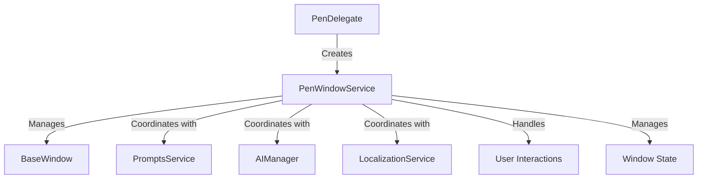
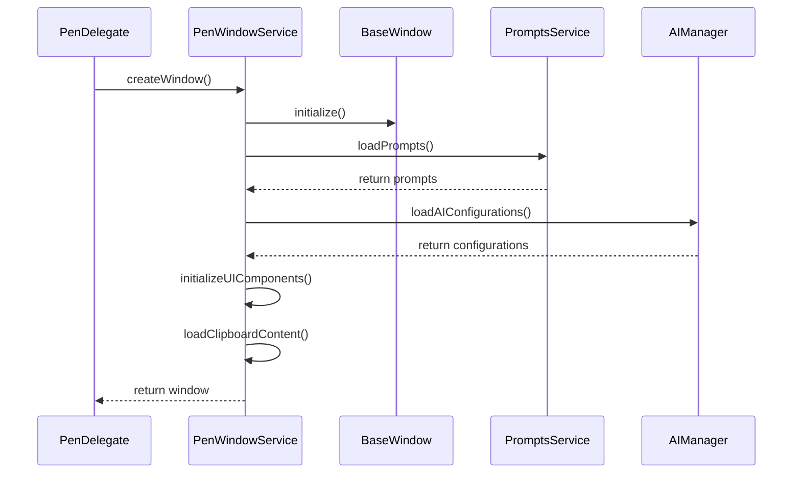
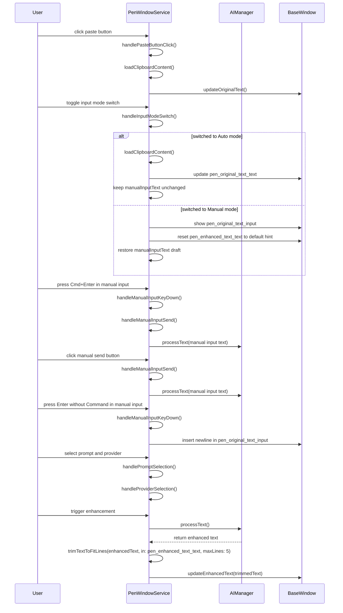
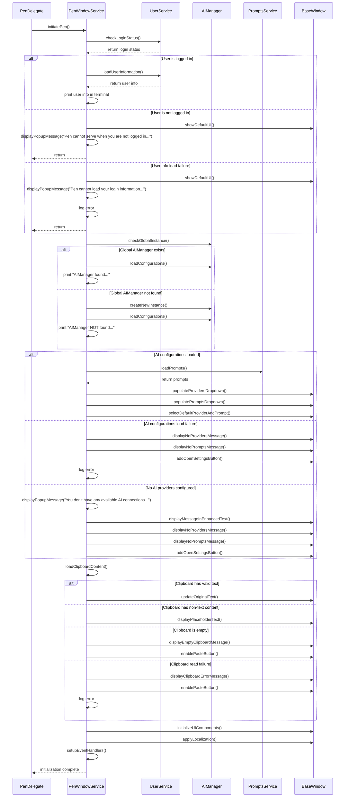
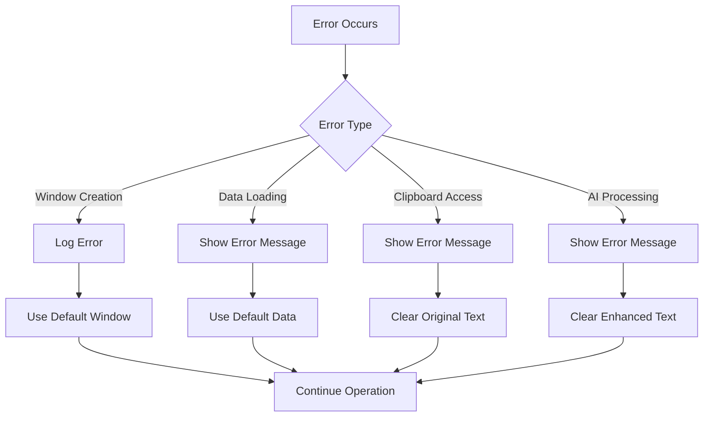

# PenWindowService Design Document

## 1. Overview

PenWindowService is a dedicated service responsible for managing all behaviors and lifecycle events of the Pen application window. It provides a centralized interface for window creation, positioning, state management, and interaction handling. This service abstracts window-related functionality from the main application logic, promoting separation of concerns and improving maintainability.

## 2. Architecture

### 2.1 System Context



### 2.2 Component Structure

- **PenWindowService**: Core service managing window operations
- **BaseWindow**: Custom window class extending NSWindow
- **WindowState**: Struct holding window state information
- **PenDelegate**: Application delegate that initializes the service

## 3. Responsibilities

### 3.1 Core Responsibilities

1. **Window Lifecycle Management**
   - Create and destroy Pen application window
   - Handle window show/hide operations
   - Manage window state persistence

2. **Window Positioning**
   - Position window relative to menu bar icon
   - Position window relative to mouse cursor
   - Clamp window to screen bounds

3. **UI Component Management**
   - Initialize and configure all UI components
   - Manage component states
   - Handle component interactions

4. **Data Integration**
   - Load user prompts from PromptsService
   - Load AI configurations from AIManager
   - Handle clipboard operations

5. **Clipboard Operations**
   - Read most recent text from Mac clipboard
   - Detect if clipboard content is text type
   - Load text type content from clipboard
   - Copy content to Mac clipboard

6. **Event Handling**
   - Handle user interactions
   - Respond to system events
   - Manage keyboard shortcuts

7. **Input Mode Switching**
   - Switch input source between Auto mode and Manual mode
   - In Auto mode, load clipboard text into `pen_original_text_text`
   - In Manual mode, use `pen_original_text_input` as editable source
   - In Manual mode, trigger enhancement by `Cmd+Enter` or send button click
   - In Manual mode, plain Enter inserts a newline without triggering enhancement
   - Preserve manual draft text across mode changes
   - Persist selected mode across logout and app restart

8. **Localization**
   - Apply localized strings to UI components
   - Handle language changes

9. **Error Handling**
   - Handle window-related errors
   - Handle clipboard-related errors
   - Display appropriate error messages

## 4. Key Components

### 4.1 PenWindowService

```swift
class PenWindowService {
    static let shared = PenWindowService()
    
    private var window: BaseWindow?
    private var windowState: WindowState
    
    // Initialization
    private init() {}
    
    // Window lifecycle methods
    func createWindow() -> BaseWindow
    func showWindow()
    func hideWindow()
    func toggleWindow()
    
    // Positioning methods
    func positionWindowRelativeToMenuBarIcon()
    func positionWindowRelativeToMouseCursor()
    func clampWindowToScreen()
    
    // UI management methods
    func initializeUIComponents()
    func updateUIComponents()
    func switchInputMode(_ mode: InputMode)
    func restoreSavedInputMode()
    
    // Data loading methods
    func loadPrompts()
    func loadAIConfigurations()
    func loadClipboardContent()
    
    // Clipboard methods
    func readClipboardText() -> String?
    func isClipboardTextType() -> Bool
    func copyToClipboard(_ text: String)
    
    // Event handling methods
    func handlePasteButtonClick()
    func handleCopyButtonClick()
    func handleInputModeSwitch()
    func handleManualInputSend()
    func handleManualInputKeyDown()
    func handlePromptSelection()
    func handleProviderSelection()
    
    // Initialization method
    func initiatePen() async
}
```

### 4.2 WindowState

```swift
struct WindowState {
    var isVisible: Bool
    var lastPosition: NSPoint
    var selectedPromptId: String?
    var selectedProviderId: String?
    var originalText: String
    var manualInputText: String
    var enhancedText: String
    var inputMode: InputMode
    
    mutating func updateState()
    func saveState()
    static func loadState() -> WindowState
}
```

```swift
enum InputMode {
    case auto
    case manual
}
```

## 5. Data Flow

### 5.1 Window Creation Flow



### 5.2 User Interaction Flow



### 5.3 InitiatePen Flow



## 6. Methods

### 6.1 Window Lifecycle Methods

| Method | Description | Parameters | Return Value |
|--------|-------------|------------|--------------|
| `createWindow()` | Creates a new Pen window | None | `BaseWindow` |
| `showWindow()` | Shows the Pen window | None | `Void` |
| `hideWindow()` | Hides the Pen window | None | `Void` |
| `toggleWindow()` | Toggles window visibility | None | `Void` |
| `closeWindow()` | Closes the Pen window | None | `Void` |

### 6.2 Positioning Methods

| Method | Description | Parameters | Return Value |
|--------|-------------|------------|--------------|
| `positionWindowRelativeToMenuBarIcon()` | Positions window near menu bar icon | None | `Void` |
| `positionWindowRelativeToMouseCursor()` | Positions window near mouse cursor | None | `Void` |
| `clampWindowToScreen()` | Ensures window stays within screen bounds | None | `Void` |

### 6.3 UI Management Methods

| Method | Description | Parameters | Return Value |
|--------|-------------|------------|--------------|
| `initializeUIComponents()` | Initializes all UI components | None | `Void` |
| `updateUIComponents()` | Updates UI components with current data | None | `Void` |
| `updateOriginalText(_:)` | Updates auto-mode original text field with trimmed display text and full-text tooltip storage | `String` | `Void` |
| `updateEnhancedText(_:)` | Updates enhanced text field with text, trims it to fit, and adds tooltip for hover-over functionality | `String` | `Void` |
| `switchInputMode(_:)` | Switches input source between Auto and Manual mode and updates related UI state | `InputMode` | `Void` |
| `restoreSavedInputMode()` | Restores previously saved input mode with Auto fallback | None | `Void` |
| `updatePromptDropdown(_:)` | Updates prompt dropdown with new data | `[Prompt]` | `Void` |
| `updateProviderDropdown(_:)` | Updates provider dropdown with new data | `[AIProvider]` | `Void` |
| `trimTextToFitLines(_:in:maxLines:)` | Trims text to fit within specified number of lines and adds "..." at the end | `String` (text to trim), `NSTextField` (text field), `Int` (max lines) | `String` (trimmed text) |

#### trimTextToFitLines Method Details

The `trimTextToFitLines` method is responsible for trimming text to fit within the specified number of lines in a text field, following the requirements from the user story. It ensures that long text is properly truncated with an ellipsis ("...") to maintain a clean UI.

**Implementation Details:**

```swift
func trimTextToFitLines(_ text: String, in textField: NSTextField, maxLines: Int) -> String {
    let font = textField.font ?? NSFont.systemFont(ofSize: 12)
    let width = textField.frame.width - 10 // Account for padding
    let height = textField.frame.height
    
    // Replace newlines with spaces to treat them as normal characters
    let textWithoutNewlines = text.replacingOccurrences(of: "\n", with: " ")
    
    let textStorage = NSTextStorage(string: textWithoutNewlines, attributes: [.font: font])
    let layoutManager = NSLayoutManager()
    textStorage.addLayoutManager(layoutManager)
    let textContainer = NSTextContainer(size: CGSize(width: width, height: height))
    textContainer.lineFragmentPadding = 0.0
    layoutManager.addTextContainer(textContainer)
    
    // Calculate the range that fits within the text field
    let range = layoutManager.glyphRange(forBoundingRect: CGRect(x: 0, y: 0, width: width, height: height), in: textContainer)
    let characterRange = layoutManager.characterRange(forGlyphRange: range, actualGlyphRange: nil)
    
    // Get the trimmed text from the original text (preserving newlines)
    var trimmedText = (text as NSString).substring(to: characterRange.upperBound)
    
    // Replace last 3 characters with "..."
    if trimmedText.count >= 3 {
        trimmedText = String(trimmedText.prefix(trimmedText.count - 3)) + "..."
    } else {
        // If text is too short, just return it
        return trimmedText
    }
    
    return trimmedText
}
```

**Usage:**

- **pen_original_text_text**: Used to trim clipboard content to fit within 5 lines
- **pen_enhanced_text_text**: Used to trim AI-enhanced text to fit within 5 lines
- **Trimming Rules**: When text exceeds the maximum lines, it displays the maximum number of lines with "..." replacing the last 3 characters of the last line

**Integration with User Story:**

This method implements the requirement from the Pen-Window.md user story that states: "AND it should be trimmed using penWindowController.trimText()" for the enhanced text display. The method name `trimTextToFitLines` is used in the implementation, but it provides the same functionality as the `trimText` method mentioned in the user story.

#### Input Mode Design

- **Auto Mode**
  - Uses `pen_original_text_text` as read-only source view
  - Loads source text from clipboard on launch and when switched to Auto mode
  - Uses `pen_original_text_text` as enhancement source
  - Keeps `manualInputText` unchanged in background state

- **Manual Mode**
  - Uses `pen_original_text_input` as editable source view
  - Restores prior `manualInputText` draft if available
  - Clears `pen_enhanced_text_text` to default hint when switching into Manual mode
  - Uses `pen_original_text_input` as enhancement source
  - `Cmd+Enter` triggers manual-send enhancement
  - Send button click triggers manual-send enhancement
  - Enter without Command inserts newline and does not trigger enhancement

- **Mode Persistence**
  - Saves mode whenever `pen_footer_auto_switch_button` changes
  - Restores saved mode after logout/login and after app relaunch
  - Falls back to Auto mode if saved value is invalid

### 6.4 Data Loading Methods

| Method | Description | Parameters | Return Value |
|--------|-------------|------------|--------------|
| `loadPrompts()` | Loads prompts for current user | None | `[Prompt]` |
| `loadAIConfigurations()` | Loads AI configurations | None | `[AIProvider]` |
| `loadClipboardContent()` | Loads content from system clipboard | None | `String?` |

### 6.5 Event Handling Methods

| Method | Description | Parameters | Return Value |
|--------|-------------|------------|--------------|
| `handlePasteButtonClick()` | Handles paste button click event | None | `Void` |
| `handleCopyButtonClick()` | Handles copy button click event | None | `Void` |
| `handleInputModeSwitch()` | Handles switch toggle and routes UI/data updates for Auto/Manual mode | None | `Void` |
| `handleManualInputSend()` | Handles manual input send action and triggers enhancement from `pen_original_text_input` | None | `Void` |
| `handleManualInputKeyDown()` | Routes manual input keyboard behavior (`Cmd+Enter` send, Enter newline) | None | `Void` |
| `handlePromptSelection(_:)` | Handles prompt selection change | `String` (prompt ID) | `Void` |
| `handleProviderSelection(_:)` | Handles provider selection change | `String` (provider ID) | `Void` |
| `handleEnhanceButtonClick()` | Handles enhance button click event, triggers AI processing, and trims the result | None | `Void` |
| `handleEnhancedTextClick()` | Handles click on enhanced text to copy to clipboard | None | `Void` |

### 6.6 Clipboard Methods

| Method | Description | Parameters | Return Value |
|--------|-------------|------------|--------------|
| `readClipboardText()` | Reads plain text from system clipboard | None | `String?` |
| `isClipboardTextType()` | Detects if clipboard content is text type | None | `Bool` |
| `copyToClipboard(_:)` | Copies text to system clipboard | `String` (text to copy) | `Void` |
| `loadClipboardContent()` | Loads clipboard content and updates UI | None | `String?` |

#### Clipboard Methods Implementation Details

```swift
// Reads plain text from system clipboard
func readClipboardText() -> String? {
    let pasteboard = NSPasteboard.general
    return pasteboard.string(forType: .string)
}

// Detects if clipboard content is text type
func isClipboardTextType() -> Bool {
    let pasteboard = NSPasteboard.general
    return pasteboard.string(forType: .string) != nil
}

// Copies text to system clipboard
func copyToClipboard(_ text: String) {
    let pasteboard = NSPasteboard.general
    pasteboard.clearContents()
    pasteboard.setString(text, forType: .string)
}

// Loads clipboard content and updates UI
func loadClipboardContent() -> String? {
    if let clipboardText = readClipboardText() {
        // Update UI with clipboard text
        updateOriginalText(clipboardText)
        return clipboardText
    } else {
        // Handle non-text or empty clipboard
        displayEmptyClipboardMessage()
        return nil
    }
}
```

#### Clipboard Error Handling

| Error Type | Description | Handling Strategy |
|------------|-------------|-------------------|
| `ClipboardAccessError` | Failed to access clipboard | Log error and display user message |
| `ClipboardContentTypeError` | Clipboard contains non-text content | Display message and enable paste button |
| `ClipboardEmptyError` | Clipboard is empty | Display placeholder text |

### 6.7 Initialization Method

| Method | Description | Parameters | Return Value |
|--------|-------------|------------|--------------|
| `initiatePen()` | Initializes Pen window according to user stories | None | `Void` |

#### InitiatePen Method Details

The `initiatePen()` method is the core initialization method that implements all the acceptance criteria from the Pen Initialization user stories. It performs the following steps:

1. **Load User Information**
   - Check if user is logged in and app is in online-login mode
   - Load user information including account settings, preferences, and usage history
   - Print user information in terminal
   - Handle online-logout mode by displaying default UI and popup message
   - Handle user information load failure by displaying error message

2. **Load AI Configurations**
   - Check if global AIManager object is available
   - Load AI configurations from global AIManager if available
   - Create new AIManager as fallback if global object is not available
   - Populate AI providers drop-down box
   - Populate prompts drop-down box with user's predefined prompts
   - Select user's default AI provider and prompt
   - Print initialization status in terminal
   - Handle AI configuration load failure
   - Handle no AI providers configured scenario

3. **Process Clipboard Content**
   - Read most recent text from system clipboard
   - Paste valid text into pen_original_text_text text field
   - Handle non-text clipboard content
   - Handle empty clipboard scenario
   - Handle clipboard read failure

4. **UI Initialization**
   - Initialize all UI components
   - Update UI with loaded data
   - Set up event handlers
   - Apply localization

5. **Error Handling**
   - Log errors for troubleshooting
   - Display appropriate error messages
   - Use fallback mechanisms when needed

## 7. Integration Points

### 7.1 External Services

- **PromptsService**: Loads user prompts and manages prompt-related operations
- **AIManager**: Handles AI-related operations and text enhancement
- **LocalizationService**: Provides localized strings for UI components
- **WindowManager**: Provides popup message functionality

### 7.2 Application Delegate

- **PenDelegate**: Initializes and coordinates with PenWindowService
- **ShortcutService**: Triggers window toggle via keyboard shortcuts

### 7.3 UI Components

- **BaseWindow**: Custom window class managed by PenWindowService
- **NSTextField**: Text fields for original and enhanced text
  - **pen_original_text_text**: Auto-mode source text (clipboard-driven, trimmed display with full-text tooltip)
  - **pen_original_text_input**: Manual-mode source text (editable, scrollable text area with hint row and send button)
  - **pen_enhanced_text_text**: Displays enhanced text with hover-over tooltip for full text
- **NSPopUpButton**: Dropdowns for prompts and providers
- **NSButton**: Paste, enhance, and manual-send buttons
- **CustomSwitch**: `pen_footer_auto_switch_button` for mode switching

## 8. Error Handling

### 8.1 Error Types

| Error Type | Description | Handling Strategy |
|------------|-------------|-------------------|
| `WindowCreationError` | Failed to create window | Log error and show default window |
| `PositioningError` | Failed to position window | Use default position |
| `DataLoadingError` | Failed to load data | Show error message and use defaults |
| `ClipboardError` | Failed to access clipboard | Show error message |
| `AIProcessingError` | Failed to process text | Show error message and clear enhanced text |

### 8.2 Error Handling Flow



## 9. Performance Considerations

### 9.1 Optimization Strategies

1. **Lazy Loading**
   - Load UI components only when needed
   - Defer heavy operations until window is actually shown

2. **Caching**
   - Cache loaded prompts and AI configurations
   - Cache clipboard content to avoid repeated access

3. **Asynchronous Operations**
   - Load data asynchronously to avoid UI blocking
   - Process text enhancement in background thread

4. **Window State Management**
   - Save window state to avoid reinitialization
   - Restore previous state on window show

### 9.2 Performance Metrics

| Metric | Target | Measurement Method |
|--------|--------|-------------------|
| Window creation time | < 100ms | Performance profiling |
| Data loading time | < 200ms | Performance profiling |
| UI response time | < 50ms | User interaction testing |
| Memory usage | < 50MB | Memory monitoring |

## 10. Future Enhancements

### 10.1 Planned Features

1. **Window Resizing**
   - Allow users to resize the Pen window
   - Persist window size between sessions

2. **Multiple Windows**
   - Support multiple Pen windows for different tasks
   - Manage window instances efficiently

3. **Custom Themes**
   - Allow users to customize window appearance
   - Support light/dark mode automatically

4. **Accessibility**
   - Improve accessibility features
   - Support screen readers and keyboard navigation

5. **Advanced Positioning**
   - Smart window positioning based on screen layout
   - Remember position per screen

### 10.2 Technical Debt

1. **Code Refactoring**
   - Extract window-specific code from PenDelegate
   - Improve error handling consistency

2. **Testing**
   - Add unit tests for PenWindowService
   - Add integration tests for window operations

3. **Documentation**
   - Add detailed API documentation
   - Update architecture diagrams as features evolve

## 11. Conclusion

PenWindowService provides a comprehensive solution for managing all aspects of the Pen application window. By centralizing window-related functionality, it improves code organization, maintainability, and performance. The service is designed to be extensible, allowing for future features and enhancements while maintaining a clean architecture.

With PenWindowService, the Pen application will benefit from:
- Consistent window behavior across the application
- Improved error handling and user feedback
- Better performance through optimized operations
- Easier maintenance and extensibility
- Enhanced user experience through thoughtful window management

This design provides a solid foundation for the Pen window system and sets the stage for future improvements and feature additions.
