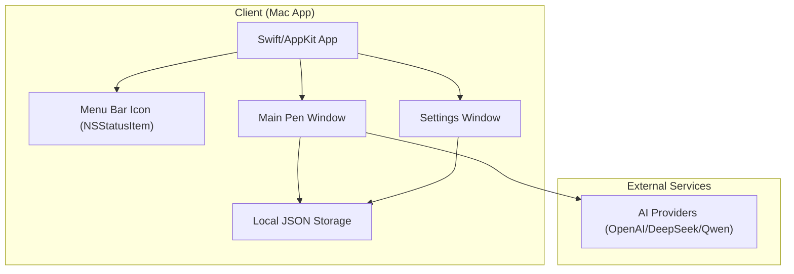

# Pen Lite Documentation

## Product Information

Pen Lite is an AI-powered writing assistant that helps you write better.
It is a native Mac app built with AppKit that runs entirely offline - no database, no user accounts, no internet required for core functionality.

The Mac app has two main interfaces:
1. **The Settings window** - Native AppKit views for managing AI connections and prompts
2. **The Pen window** - Where you can use AI to help you write better by processing text from clipboard

## Architecture

### Tech Stack

| Component | Technology | Rationale |
|-----------|------------|-----------|
| **Mac App** | Swift + AppKit | Native Mac development with traditional Cocoa framework; integrates with macOS menu bar |
| **AI Integration** | Multi-Provider Client (OpenAI/DeepSeek/Qwen) | Direct AI provider integration from Mac app with unified interface |
| **Data Storage** | Local JSON Files | All data stored locally in `~/Library/Application Support/Pen.Lite/` |

### Architecture Diagram



### Key Architectural Decisions

1. **Native Mac App (AppKit, not SwiftUI)**
   - Traditional Cocoa framework for maximum control and compatibility
   - No backend server required
   - All data stored locally on the user's Mac

2. **Offline-First Design**
   - No user accounts or authentication required
   - No database connection needed
   - Works without internet (except for AI calls)

3. **Local Data Storage**
   - AI connections stored in `~/Library/Application Support/Pen.Lite/config/ai-connections.json`
   - Prompts stored in `~/Library/Application Support/Pen.Lite/prompts/`
   - Default configurations bundled with the app

4. **Multi-AI Provider Integration**
   - `AIManager.swift` provides unified interface for multiple AI providers
   - Supports GPT, DeepSeek, Qwen, and custom providers
   - Extensible architecture for adding new AI models

5. **Internationalization (i18n) Support**
   - `.strings` files in `en.lproj/` and `zh-Hans.lproj/`
   - Custom `LocalizationService` for runtime language switching
   - Language preference persisted in UserDefaults

### Data Flow Example (AI Request)

1. **User Triggers AI Help**
   - User copies text to clipboard
   - Opens Pen window via menu bar icon
   - Text is automatically retrieved from clipboard
   - User selects prompt and AI provider

2. **Processing**
   - `AIManager` loads API key from local storage
   - Constructs request with selected prompt template
   - Calls AI provider API directly

3. **Response**
   - AI provider returns generated text
   - Response displayed in Pen window
   - User can copy the enhanced text

### Local Storage Structure

```
~/Library/Application Support/Pen.Lite/
├── config/
│   └── ai-connections.json    # User's AI provider configurations
└── prompts/
    ├── *.json                  # User's custom prompts
    └── ...
```

### Default Configurations

The app comes with default configurations bundled in the app:

```
Pen Lite.app/Contents/Resources/
├── ai-config/
│   └── default-ai-configurations.json    # Default AI providers
├── prompts/
│   ├── default-refine-english.json       # Default prompts
│   ├── default-translator.json
│   └── default-prompt-creator.json
├── Assets/
├── en.lproj/
└── zh-Hans.lproj/
```

### Deployment

| Service | Configuration |
|---------|---------------|
| **Mac App** | Distributed as .dmg file; runs locally on user's Mac |
| **AI Providers** | User's own API keys for OpenAI, DeepSeek, Qwen, etc. |
