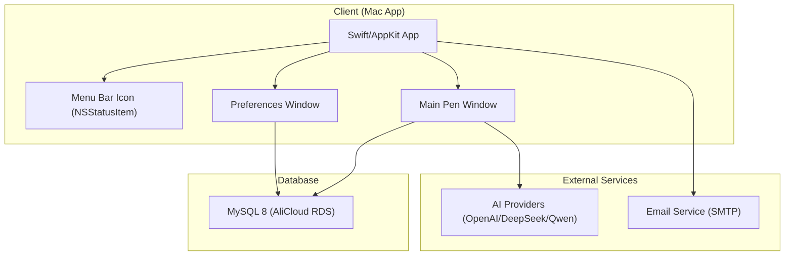

# Pen Docs
## Product information
Pen is an AI powered product that helps you to write better.
It is a native Mac app built with AppKit that connects directly to a MySQL database.
The Mac app has two main interfaces:
1. The management interface (Preferences window) - native AppKit views for managing account settings, AI connections, prompts, and history.
2. The main Pen window - where you can use AI to help you write better by processing text from clipboard.

## Architecture

### Tech Stack

| Component | Technology | Rationale |
|-----------|------------|-----------|
| **Mac App** | Swift + AppKit | Native Mac development with traditional Cocoa framework; integrates with macOS menu bar and right-click menus. |
| **Backend API** | Node.js (NestJS) + TypeScript | Minimal backend for optional future expansion; currently most operations go directly to MySQL. |
| **Database** | MySQL 8 (AliCloud RDS) | Structured schema for user accounts, settings, AI model configurations, prompts, and content history. |
| **AI Integration** | Multi-Provider Client (OpenAI/DeepSeek/Qwen) | Direct AI provider integration from Mac app with unified interface. |
| **Cloud Hosting** | AliCloud (RDS) | RDS for managed MySQL database. |
| **Authentication** | Direct Database + BCrypt | Password hashing with BCrypt; direct database authentication. |

### Architecture Diagram



### Key Architectural Decisions

1. **Native Mac App (AppKit, not SwiftUI)**
   - Traditional Cocoa framework for maximum control and compatibility
   - Direct MySQL database connection for simplicity and performance
   - No intermediate backend API layer for most operations

2. **Direct Database Connection**
   - Mac app connects directly to MySQL via `DatabaseConnectivityPool`
   - Reduces latency and infrastructure complexity
   - All user data, AI connections, prompts stored in MySQL

3. **Multi-AI Provider Integration**
   - `AIManager.swift` provides unified interface for multiple AI providers
   - Supports GPT-4o-mini, DeepSeek 3.2, Qwen-Plus
   - Extensible architecture for adding new AI models

4. **Security**
   - BCrypt password hashing
   - AI provider API keys stored in database
   - Keychain integration for sensitive data

5. **Internationalization (i18n) Support**
   - `.strings` files in `en.lproj/` and `zh-Hans.lproj/`
   - Custom `LocalizationService` for runtime language switching
   - Language preference persisted in UserDefaults

### Data Flow Example (AI Request)

1. **User Triggers AI Help**
   - User copies text to clipboard
   - Opens Pen window via menu bar icon or keyboard shortcut
   - Text is automatically retrieved from clipboard
   - User selects prompt and AI provider

2. **Processing**
   - `AIManager` fetches user's API key from database
   - Constructs request with selected prompt template
   - Calls AI provider API directly

3. **Response & Storage**
   - AI provider returns generated text
   - Response displayed in Pen window
   - Enhancement saved to `content_history` table

### Database Schema

```sql
-- Users Table
CREATE TABLE users (
    id INT PRIMARY KEY AUTO_INCREMENT,
    name VARCHAR(255),
    email VARCHAR(255) UNIQUE NOT NULL,
    password_hash VARCHAR(255) NOT NULL,
    profile_image LONGBLOB,
    created_at TIMESTAMP DEFAULT CURRENT_TIMESTAMP,
    updated_at TIMESTAMP DEFAULT CURRENT_TIMESTAMP ON UPDATE CURRENT_TIMESTAMP,
    system_flag VARCHAR(50),
    pen_content_history INT DEFAULT 40
);

-- AI Providers Table (system-level)
CREATE TABLE ai_providers (
    id INT PRIMARY KEY AUTO_INCREMENT,
    name VARCHAR(50) UNIQUE NOT NULL,
    base_urls JSON NOT NULL,
    default_model VARCHAR(100),
    requires_auth BOOLEAN DEFAULT TRUE,
    auth_header VARCHAR(50) DEFAULT 'Authorization',
    created_at TIMESTAMP DEFAULT CURRENT_TIMESTAMP,
    updated_at TIMESTAMP DEFAULT CURRENT_TIMESTAMP ON UPDATE CURRENT_TIMESTAMP
);

-- AI Connections Table (user-level)
CREATE TABLE ai_connections (
    id INT PRIMARY KEY AUTO_INCREMENT,
    user_id INT REFERENCES users(id),
    provider_id INT REFERENCES ai_providers(id),
    api_key VARCHAR(255) NOT NULL,
    created_at TIMESTAMP DEFAULT CURRENT_TIMESTAMP,
    updated_at TIMESTAMP DEFAULT CURRENT_TIMESTAMP ON UPDATE CURRENT_TIMESTAMP
);

-- Prompts Table
CREATE TABLE prompts (
    id INT PRIMARY KEY AUTO_INCREMENT,
    user_id INT REFERENCES users(id),
    name VARCHAR(100) NOT NULL,
    text TEXT NOT NULL,
    is_default BOOLEAN DEFAULT FALSE,
    created_at TIMESTAMP DEFAULT CURRENT_TIMESTAMP,
    updated_at TIMESTAMP DEFAULT CURRENT_TIMESTAMP ON UPDATE CURRENT_TIMESTAMP
);

-- Content History Table
CREATE TABLE content_history (
    uuid VARCHAR(36) PRIMARY KEY,
    user_id INT REFERENCES users(id),
    enhanced_datetime TIMESTAMP DEFAULT CURRENT_TIMESTAMP,
    content_original TEXT,
    content_enhanced TEXT,
    prompt_text TEXT,
    ai_provider VARCHAR(50)
);

-- System Config Table
CREATE TABLE system_config (
    id INT PRIMARY KEY AUTO_INCREMENT,
    config_key VARCHAR(100) UNIQUE NOT NULL,
    config_value TEXT NOT NULL,
    description VARCHAR(255),
    created_at TIMESTAMP DEFAULT CURRENT_TIMESTAMP,
    updated_at TIMESTAMP DEFAULT CURRENT_TIMESTAMP ON UPDATE CURRENT_TIMESTAMP
);
```

### Deployment

| Service | Configuration |
|---------|---------------|
| **Mac App** | Distributed as .dmg file; runs locally on user's Mac |
| **Database** | AliCloud RDS MySQL 8.0; managed service |
| **Email** | SMTP service for password reset emails |
